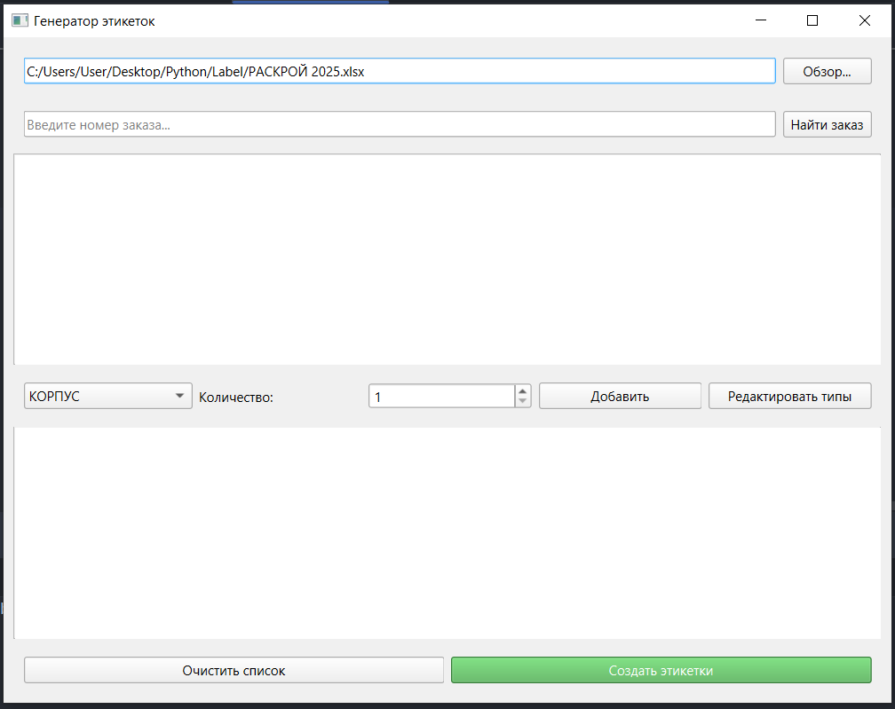

# Генератор этикеток для мебельного производства



Программа для автоматического создания этикеток с техническими характеристиками мебельных изделий на основе данных из Excel.

## 🔹 Возможности

- Поиск заказов по номеру в базе Excel
- Генерация этикеток для разных типов изделий:
  - Корпусная мебель
  - Фасады МДФ
  - Фасады пластик
  - Дополнительные элементы
  - Оргалит
- Настройка количества этикеток для каждого типа
- Редактирование данных перед генерацией
- Автоматическое формирование Excel-файла с этикетками

## 🔹 Установка

### Вариант 1: Готовый EXE-файл
1. Скачайте последнюю версию из [раздела Releases](https://github.com/daniilseliverstov/Label/releases/tag/Python)
2. Распакуйте архив в любую папку
3. Запустите `LabelGenerator.exe`

> ⚠️ В архиве должна быть папка `images` с файлами:  
> - Logo.png  
> - EAC.png  
> - Contacts.png  

### Вариант 2: Установка из исходного кода
1. Убедитесь, что установлен Python 3.10+
2. Клонируйте репозиторий:
   ```bash
   git clone https://github.com/ваш-репозиторий.git

    Установите зависимости:
    bash

pip install -r requirements.txt

Запустите программу:
bash

    python main_app.py

🔹 Использование

    Укажите путь к файлу Excel с данными раскроя

    Введите номер заказа и нажмите "Найти заказ"

    Выберите тип этикетки и количество

    При необходимости отредактируйте данные

    Нажмите "Создать этикетки"

    Укажите путь для сохранения файла

🔹 Требования

    Windows 10/11

    Для версии из исходного кода:

        Python 3.10+

        Библиотеки из requirements.txt


🔹 Сборка EXE-файла

Для самостоятельной сборки:
bash

pyinstaller --onefile --windowed --add-data "images/*;images" --add-data "label_generator_config.json;." --icon=images/icon.ico main_app.py

🔹 Лицензия

Проект распространяется под лицензией MIT.

Разработано для [KODMI Мебель] | 2025
